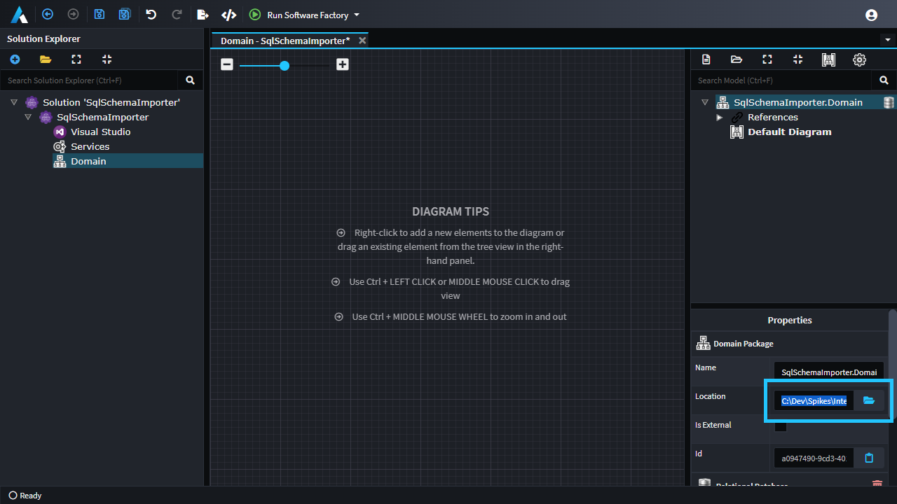

# Sample code for extracting a SQL Server schema into an Intent Architect package

This repository contains a sample C# application which connects to a SQL Server, analyzes its schema and then generates a package containing with the extracted "domain" including classes, their attributes and their associations to each other.

The intent of this working sample code is to give a starting point for developers wanting to write a program to import data into Intent Architect.

NOTE: While this code has been found to work against a variety of schemas already of other Intent Architect users, it has not been exhaustively tested or checked to ensure it covers all SQL Server schemas. Please create a pull request with desired changes or [log an issue](https://github.com/IntentArchitect/Support/issues).

## Pre-requisites

- [.NET SDK](https://dotnet.microsoft.com/download/visual-studio-sdks) (6.0 or greater)
- [Connection string](https://www.connectionstrings.com/sql-server/) for your SQL Server database.
- [Intent Architect](https://intentarchitect.com/#/downloads) (4.0.0 or greater)

## Running the code

### Have an output package created in Intent Architect

The extractor will need the path of an Intent Architect package as the output in which to place extracted Intent metadata based on the database schema.

If you don't already have an Intent Architect application, create one which includes the domain designer. The quickest way to do this is to use the `Clean Architecture .NET` [application template](https://docs.intentarchitect.com/articles/application-templates/about-application-templates/about-application-templates.html).

For the application into which you want the metadata to be extracted, open the Domain designer, click in the `Location` text box, press `Ctrl+A` to select all the text and then `Ctrl+C` to copy the path to your clipboard.

#### Use Git (or similar SCM)

We advise this Intent Architect application and package exists in a Git (or similar SCM) repository and ensuring any changes for it have been so that the working directory is clean before doing the extraction. This will allow reverting of any changes in the event they're undesirable or you wish to re-run it again "from scratch" after making changes to the extractor's source code.

### Run the tool

From inside the `./Intent.SQLSchemaExtractor` folder use the `dotnet run` command (or alternatively open the `.sln` with your IDE and start it).

When prompted to `Enter database connection:`, enter a [SQL server connection string](https://www.connectionstrings.com/sql-server/) for the database you want to connect to and from which the schema will be extracted and press return.

When prompted to `Enter output Intent Package:` paste the path you copied to your clipboard during the [above step](#have-an-output-package-created-in-intent-architect). As a reminder, [the output Intent Package should ideally be in Git (or similar SCM)](#use-git-or-similar-scm).

As the program executes it will write to the console each _class_ and _relationship_ it creates and should finally say `Package saved successfully`.
